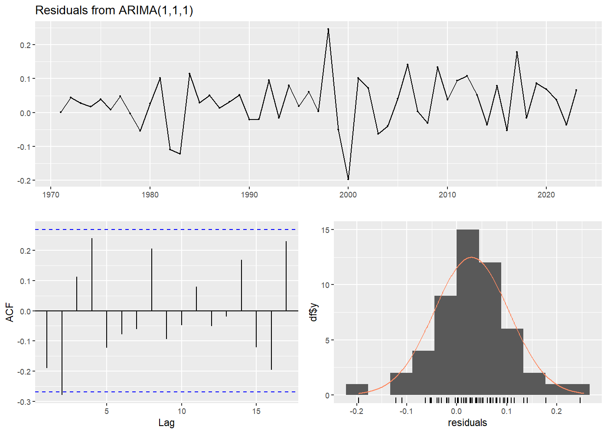
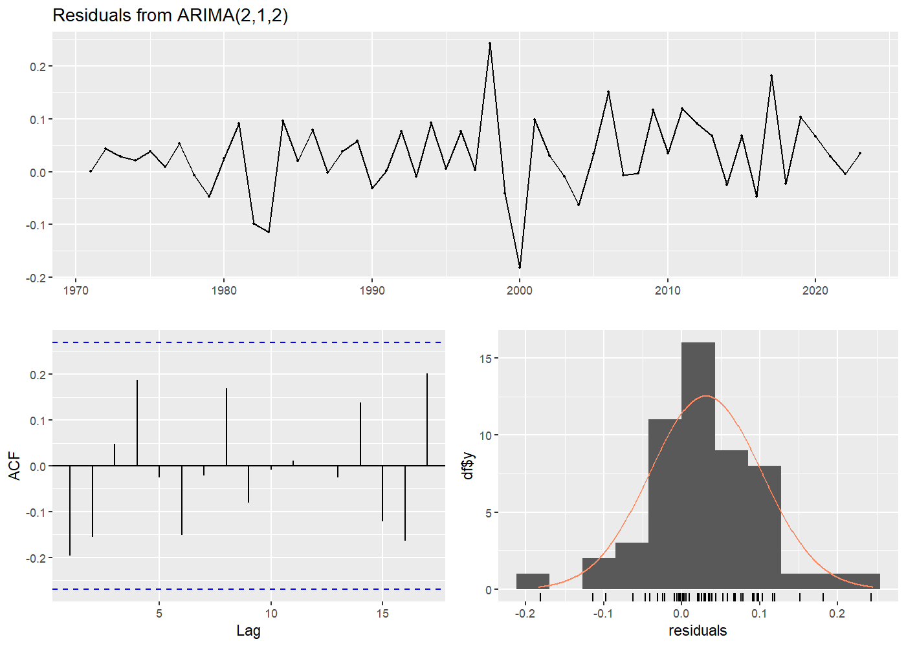
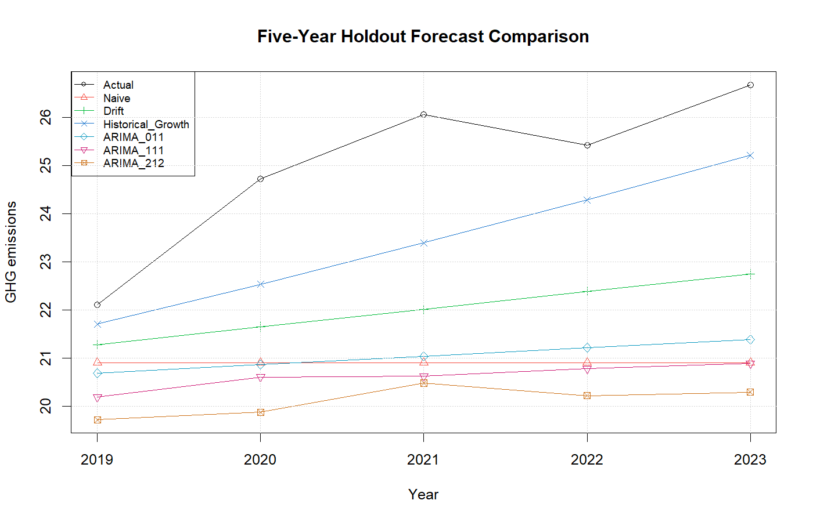
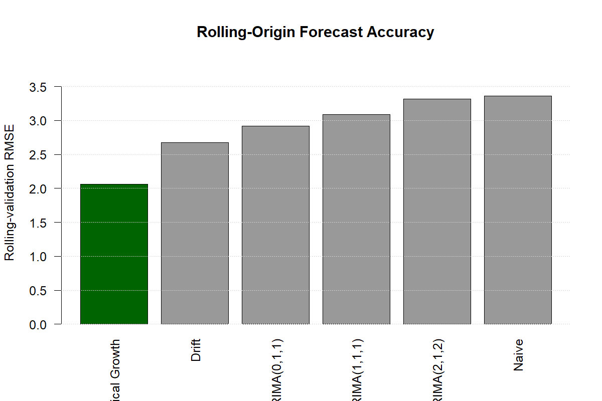
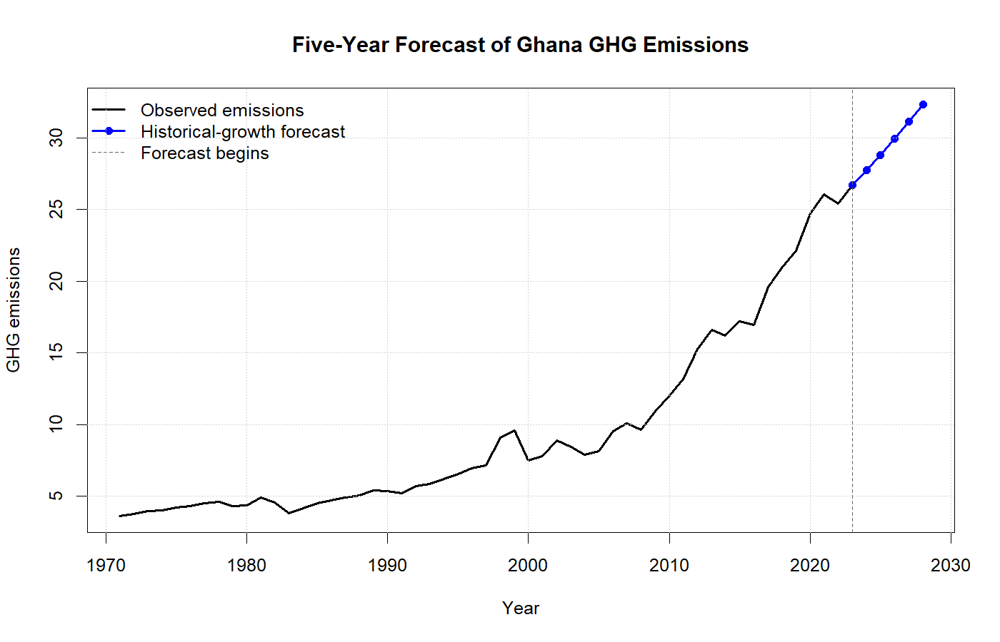

# A Time Series Analysis and Forecasting of Greenhouse Gas Emissions from Energy in Ghana

## Overview

This project analyzes annual greenhouse gas emissions from energy in Ghana from 1971 through 2023 and forecasts emissions for 2024–2028. It develops a reproducible R forecasting pipeline and compares ARIMA models with naïve, drift, and historical-growth benchmarks.

Model selection is based on both residual diagnostics and out-of-sample forecast accuracy. Across 570 rolling-origin forecasts, the historical-growth method produced the lowest overall RMSE and the most consistent performance. It was therefore selected as the preferred point-forecasting method.

## Project Highlights

- Analyzed 53 annual observations covering 1971–2023.
- Compared four ARIMA specifications using AIC, AICc, BIC, residual ACFs, and Ljung–Box tests.
- Evaluated six forecasting methods using a five-year holdout period.
- Conducted expanding-window validation across 19 forecast origins and five forecast horizons.
- Evaluated 570 out-of-sample forecasts in total.
- Selected historical growth based on the lowest rolling-validation RMSE of 2.0592.
- Generated point forecasts through 2028 using an estimated annual compounded growth rate of 3.92%.

## Table of Contents

1. [Research Question](#research-question)
2. [Data](#data)
3. [Repository Structure](#repository-structure)
4. [Methods](#methods)
5. [Correction to the Original Analysis](#correction-to-the-original-analysis)
6. [ARIMA Model Comparison](#arima-model-comparison)
7. [Residual Diagnostics](#residual-diagnostics)
8. [Holdout Evaluation](#holdout-evaluation)
9. [Rolling-Origin Validation](#rolling-origin-validation)
10. [Final Model Selection](#final-model-selection)
11. [Final Forecast](#final-forecast)
12. [Uncertainty and Limitations](#uncertainty-and-limitations)
13. [Reproducing the Analysis](#reproducing-the-analysis)
14. [Author](#author)

## Research Question

How have Ghana's energy-related greenhouse gas emissions changed over time, and which forecasting method provides the most accurate predictions for the next five years?

## Data

| Item | Description |
|---|---|
| Country | Ghana |
| Period | 1971–2023 |
| Frequency | Annual |
| Observations | 53 |
| Variable | Greenhouse gas emissions from energy |
| Unit | Million tonnes of CO₂ equivalent |
| Source | International Energy Agency database |

The original dataset contains annual greenhouse gas emissions for several African countries and emission sources. This analysis focuses on Ghana's emissions from energy.

The dataset should be stored in the `data/` directory as `GHG_emissions.xlsx`.

## Repository Structure

```text
ghana-emissions-forecasting/
├── README.md
├── ghana-emissions-forecasting.Rproj
├── requirements.R
├── data/
│   └── GHG_emissions.xlsx
├── scripts/
│   └── emissions_analysis.R
├── figures/
│   ├── ghana_emissions_history.png
│   ├── arima_111_diagnostics.png
│   ├── arima_212_diagnostics.png
│   ├── holdout_forecast_comparison.png
│   ├── rolling_validation_rmse.png
│   └── final_historical_growth_forecast.png
└── results/
    ├── model_comparison.csv
    ├── holdout_model_comparison.csv
    ├── holdout_forecasts.csv
    ├── rolling_origin_predictions.csv
    ├── rolling_origin_model_comparison.csv
    ├── rolling_origin_by_horizon.csv
    └── historical_growth_five_year_forecast.csv
```

## Methods

The analysis includes:

1. Importing and cleaning the annual emissions data.
2. Converting Ghana's emissions to an annual time-series object.
3. Plotting the historical trend.
4. Applying a logarithmic transformation.
5. Assessing stationarity using time plots, first differences, ACF, and PACF.
6. Fitting and comparing candidate ARIMA models.
7. Evaluating residual independence using residual ACFs and Ljung–Box tests.
8. Comparing ARIMA models with naïve, drift, and historical-growth benchmarks.
9. Conducting a five-year holdout evaluation using 2019–2023.
10. Conducting expanding-window rolling-origin validation.
11. Refitting the selected method to the complete series.
12. Producing point forecasts for 2024–2028.

Forecast accuracy was evaluated using:

- **MAE:** Mean absolute error.
- **RMSE:** Root mean squared error, which penalizes larger errors more heavily.
- **Bias:** Mean forecast error, calculated as forecast minus actual. Negative values indicate underforecasting.
- **MASE:** Mean absolute scaled error relative to the average in-sample one-step naïve error.

## Analysis

This analysis fits ARIMA(p,1,q) models directly to the logged emission-level series, ensuring that the series is differenced only once. When `Arima()` is fitted to the original series with `lambda = 0`, the `forecast` package performs the log transformation internally and returns forecasts on the original emissions scale. Those forecasts must not be exponentiated again.


## ARIMA Model Comparison

Four ARIMA specifications were evaluated.

| Model | AIC | AICc | BIC |
|---|---:|---:|---:|
| ARIMA(1,1,0) | -104.0853 | -103.8404 | -100.1828 |
| ARIMA(0,1,1) | -107.7931 | **-107.5482** | **-103.8906** |
| ARIMA(1,1,1) | **-107.9906** | -107.4906 | -102.1369 |
| ARIMA(2,1,2) | -107.2103 | -105.9060 | -97.4541 |

ARIMA(1,1,1) had the lowest AIC, while ARIMA(0,1,1) had the lowest AICc and BIC. The small information-criterion differences between these two models indicate similar in-sample fit. ARIMA(2,1,2) received a larger complexity penalty because it estimates more parameters.

## Residual Diagnostics

| Model | Ljung–Box p-value | Assessment |
|---|---:|---|
| ARIMA(1,1,0) | 0.0023 | Significant residual autocorrelation |
| ARIMA(0,1,1) | 0.0257 | Significant residual autocorrelation |
| ARIMA(1,1,1) | 0.0479 | Borderline residual adequacy |
| ARIMA(2,1,2) | 0.1449 | No significant residual autocorrelation detected |

ARIMA(2,1,2) was the only candidate that clearly passed the Ljung–Box test at the 5% significance level. Its residual ACF contained no obvious significant spikes. However, two of its four ARMA coefficients were not individually significant, and its BIC was higher than those of the simpler models. It was therefore retained as the strongest diagnostic candidate but not automatically selected for forecasting.

### Diagnostic Figures





## Holdout Evaluation

The final five observations, covering 2019–2023, were reserved as a holdout set. Each method was fitted using observations from 1971–2018 and evaluated against the same five actual values.

The methods compared were:

- Naïve forecast
- Random walk with drift
- Historical-growth benchmark
- ARIMA(0,1,1)
- ARIMA(1,1,1)
- ARIMA(2,1,2)

Historical growth produced the best holdout performance. Because this result was based on only one five-year test period, it was subsequently assessed using rolling-origin validation.



## Rolling-Origin Validation

Expanding-window rolling-origin validation was conducted using forecast origins from 2000 through 2018 and a five-year forecast horizon. At each origin, each method was refitted using only the observations available at that time.

There were 19 forecast origins, five horizons per origin, and six methods. This produced 95 forecasts per method and 570 out-of-sample forecasts overall.

### Overall Forecast Accuracy

| Rank | Method | Forecasts | MAE | RMSE | Bias | MASE |
|---:|---|---:|---:|---:|---:|---:|
| 1 | **Historical Growth** | 95 | **1.6074** | **2.0592** | **-1.3085** | **3.3236** |
| 2 | Drift | 95 | 2.0805 | 2.6741 | -1.9133 | 4.2177 |
| 3 | ARIMA(0,1,1) | 95 | 2.2395 | 2.9179 | -2.0283 | 4.5640 |
| 4 | ARIMA(1,1,1) | 95 | 2.4028 | 3.0860 | -2.2572 | 4.8643 |
| 5 | ARIMA(2,1,2) | 95 | 2.5895 | 3.3142 | -2.5005 | 5.2062 |
| 6 | Naïve | 95 | 2.6676 | 3.3625 | -2.5802 | 5.3914 |

Historical growth achieved the lowest MAE, RMSE, and MASE and had the bias closest to zero. All methods had negative bias, indicating a general tendency to underforecast emissions.

### Stability Across Forecast Origins

| Method | Average origin RMSE | SD of origin RMSE | Worst origin RMSE |
|---|---:|---:|---:|
| **Historical Growth** | **1.8075** | **1.0136** | **4.1613** |
| Drift | 2.3602 | 1.2916 | 5.2454 |
| ARIMA(0,1,1) | 2.5370 | 1.4809 | 6.5490 |
| ARIMA(1,1,1) | 2.7181 | 1.5014 | 6.4703 |
| ARIMA(2,1,2) | 2.9167 | 1.6170 | 6.5752 |
| Naïve | 3.0146 | 1.5302 | 6.2245 |

Historical growth had the lowest average origin RMSE, the smallest standard deviation of origin RMSE, and the lowest worst-origin RMSE. Its overall advantage was therefore not driven by only one favorable forecast period.

### Accuracy by Forecast Horizon

| Forecast horizon | Historical-growth RMSE | Next-best method | Next-best RMSE |
|---:|---:|---|---:|
| 1 year | **0.9279** | Drift | 1.0256 |
| 2 years | **1.4873** | Drift | 1.7803 |
| 3 years | **1.9879** | Drift | 2.5185 |
| 4 years | **2.4415** | Drift | 3.1905 |
| 5 years | **2.8663** | Drift | 3.8744 |

Historical growth produced the lowest RMSE at every forecast horizon. Errors increased as the horizon became longer, as expected, but the relative ranking remained unchanged.



## Final Model Selection

Historical growth was selected as the preferred point-forecasting method because it:

- Produced the lowest rolling-validation MAE and RMSE.
- Had the bias closest to zero.
- Had the lowest average, standard deviation, and worst value of origin-specific RMSE.
- Ranked first at every forecast horizon from one to five years.
- Outperformed every ARIMA specification and the other benchmarks.

ARIMA(2,1,2) provided the strongest residual diagnostics but performed worse out of sample than the historical-growth and drift methods. This demonstrates why information criteria and residual diagnostics should not be used alone to select a forecasting method.

The historical-growth MASE remained greater than one. This means its multi-horizon forecast errors exceeded the average in-sample one-step naïve error used as the scaling denominator. Historical growth was therefore the best method among those evaluated, but its forecast error was not negligible.

## Final Forecast

The historical-growth method was refitted using the complete 1971–2023 series. The estimated average annual log-growth rate was 0.03849, corresponding to an annual compounded growth rate of approximately **3.92%**.

| Year | Forecast in million tonnes CO₂ equivalent |
|---:|---:|
| 2024 | 27.7235 |
| 2025 | 28.8115 |
| 2026 | 29.9421 |
| 2027 | 31.1172 |
| 2028 | 32.3383 |

The final observed value in 2023 was approximately 26.6766 million tonnes of CO₂ equivalent. The method applies the estimated average growth rate cumulatively, producing a forecast of approximately 32.34 million tonnes of CO₂ equivalent by 2028.



## Uncertainty and Limitations

- The reported historical-growth values are point forecasts, not prediction intervals.
- Historical growth assumes that the average past growth rate will continue through 2028.
- All evaluated methods had negative rolling-validation bias and tended to underforecast emissions.
- Historical growth had a MASE greater than one, indicating meaningful error relative to the in-sample one-step naïve scaling benchmark.
- The annual dataset contains only 53 observations.
- Rolling-origin test periods overlap because each origin uses a five-year horizon.
- Univariate models do not directly account for economic activity, population, energy consumption, technology, environmental policy, or structural breaks.
- Forecast uncertainty generally increases as the forecast horizon becomes longer.
- Future emissions may differ substantially from the forecasts if Ghana's economic, technological, energy, or policy conditions change.

## Reproducing the Analysis

### Requirements

- R
- RStudio
- `astsa`
- `forecast`
- `here`
- `readxl`

Install the required packages by running:

```r
source("requirements.R")
```

Alternatively:

```r
install.packages(c("astsa", "forecast", "here", "readxl"))
```

### Instructions

1. Clone or download this repository.
2. Open `ghana-emissions-forecasting.Rproj` in RStudio.
3. Place the data file at `data/GHG_emissions.xlsx`.
4. Install the required packages.
5. Open `scripts/emissions_analysis.R`.
6. Select **Session → Restart R**.
7. Run the complete script using **Source**.
8. Confirm that the tables appear in `results/` and the plots appear in `figures/`.

The script uses `here()` for project-relative paths and should not require changes for a particular computer. It must run from a fresh R session without relying on objects stored in the Global Environment.

## Main Outputs

- `results/model_comparison.csv`: ARIMA information-criterion comparison.
- `results/holdout_model_comparison.csv`: Day 4 holdout accuracy results.
- `results/rolling_origin_model_comparison.csv`: Overall rolling-validation results.
- `results/rolling_origin_by_horizon.csv`: Accuracy by forecast horizon.
- `results/historical_growth_five_year_forecast.csv`: Final 2024–2028 point forecasts.
- `figures/final_historical_growth_forecast.png`: Final historical series and forecast figure.

## Portfolio Summary

- Developed a reproducible R time-series forecasting pipeline for Ghana's 1971–2023 greenhouse gas emissions, comparing ARIMA specifications with naïve, drift, and historical-growth benchmarks using holdout and rolling-origin validation.
- Evaluated 570 out-of-sample forecasts across six methods and five forecast horizons; selected historical growth based on the lowest RMSE of 2.06 and generated five-year emissions forecasts through 2028.

## Author

**Yaa Sarpomaa Sarpong**  
PhD Candidate in Applied Statistics  
University of Memphis
